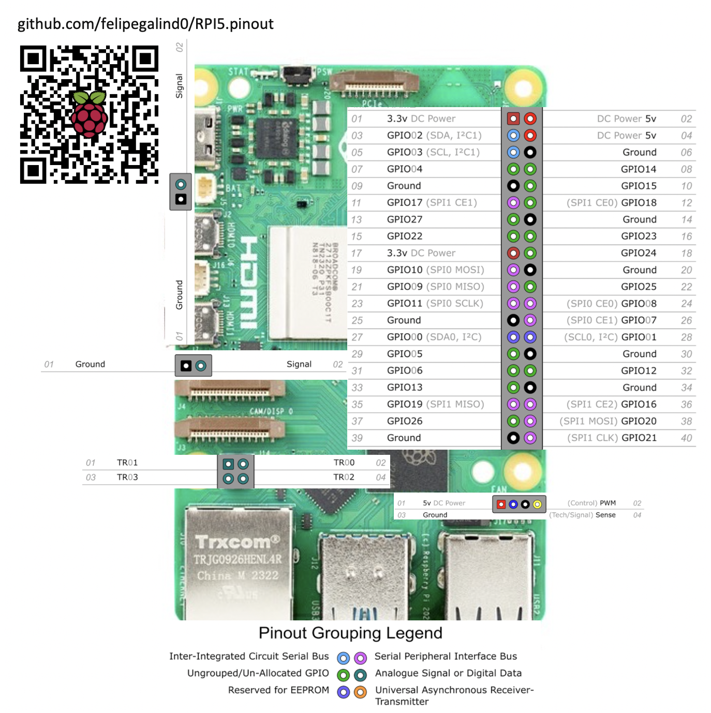
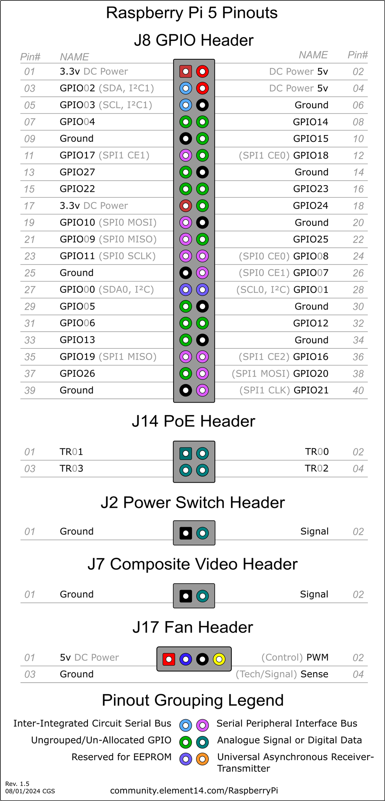

# Raspberry Pi 5 Pinout



The RP1 on the RPI5 has 28 multi-functional General-Purpose Input/Output pins available on the Raspberry Pi 40-pin
GPIO connector.

GPIO pins can withstand upto 5V when RP1 is powered, and 3.63V when RP1 is unpowered.

The pins are in a single electrical bank (VDDIO0). The GPIO bank (IO_BANK0) can be powered from 1.8V or 3.3V, but
interface timings have been specified at 3.3V. 

Each pin can be controlled directly by software, or by a number of other functional blocks.

The bank supports the following functions:
```
• 5 × UART
• 6 × SPI
• 4 × I2C
• 2 × I2S - 1× Clock Producer instance, 1× Clock Consumer instance.
• RIO - Registered IO interface
• 24-bit DPI output
• 4-channel PWM output
• AUDIO_OUT - Stereo PWM audio output
• GPCLK - General-purpose clock input and output
• eMMC/SDIO bus with a 4-bit interface
• Interrupt generation from pin level or edge transitions
```
| GPIO Number | Function             |           |              |               |             |              |              |             |             |
|----------|--------------|-----------|--------------|---------------|-------------|--------------|--------------|-------------|-------------|
| GPIO#     | F1           | F2        | F3           | F4            | F5          | F6           | F7           | F8          | F9          |
| GPIO0    | SPI0_SIO[3]  | DPI_PCLK  | UART1_TX     | I2C0_SDA      | SYS_RIO[0]  | PROC_RIO[0]  | PIO[0]       | SPI2_CSn[0] |             |
| GPIO1    | SPI0_SIO[2]  | DPI_DE    | UART1_RX     | I2C0_SCL      | SYS_RIO[1]  | PROC_RIO[1]  | PIO[1]       | SPI2_SIO[1] |             |
| GPIO2    | SPI0_CSn[3]  | DPI_VSYNC | UART1_CTS    | I2C1_SDA      | UART0_IR_RX | SYS_RIO[2]   | PROC_RIO[2]  | PIO[2]      | SPI2_SIO[0] |
| GPIO3    | SPI0_CSn[2]  | DPI_HSYNC | UART1_RTS    | I2C1_SCL      | UART0_IR_TX | SYS_RIO[3]   | PROC_RIO[3]  | PIO[3]      | SPI2_SCLK   |
| GPIO4    | GPCLK[0]     | DPI_D[0]  | UART2_TX     | I2C2_SDA      | UART0_RI    | SYS_RIO[4]   | PROC_RIO[4]  | PIO[4]      | SPI3_CSn[0] |
| GPIO5    | GPCLK[1]     | DPI_D[1]  | UART2_RX     | I2C2_SCL      | UART0_DTR   | SYS_RIO[5]   | PROC_RIO[5]  | PIO[5]      | SPI3_SIO[1] |
| GPIO6    | GPCLK[2]     | DPI_D[2]  | UART2_CTS    | I2C3_SDA      | UART0_DCD   | SYS_RIO[6]   | PROC_RIO[6]  | PIO[6]      | SPI3_SIO[0] |
| GPIO7    | SPI0_CSn[1]  | DPI_D[3]  | UART2_RTS    | I2C3_SCL      | UART0_DSR   | SYS_RIO[7]   | PROC_RIO[7]  | PIO[7]      | SPI3_SCLK   |
| GPIO8    | SPI0_CSn[0]  | DPI_D[4]  | UART3_TX     | I2C0_SDA      | SYS_RIO[8]  | PROC_RIO[8]  | PIO[8]       | SPI4_CSn[0] |             |
| GPIO9    | SPI0_SIO[1]  | DPI_D[5]  | UART3_RX     | I2C0_SCL      | SYS_RIO[9]  | PROC_RIO[9]  | PIO[9]       | SPI4_SIO[0] |             |
| GPIO10   | SPI0_SIO[0]  | DPI_D[6]  | UART3_CTS    | I2C1_SDA      | SYS_RIO[10] | PROC_RIO[10] | PIO[10]      | SPI4_SIO[1] |             |
| GPIO11   | SPI0_SCLK    | DPI_D[7]  | UART3_RTS    | I2C1_SCL      | SYS_RIO[11] | PROC_RIO[11] | PIO[11]      | SPI4_SCLK   |             |
| GPIO12   | PWM0[0]      | DPI_D[8]  | UART4_TX     | I2C2_SDA      | AUDIO_OUT_L | SYS_RIO[12]  | PROC_RIO[12] | PIO[12]     | SPI5_CSn[0] |
| GPIO13   | PWM0[1]      | DPI_D[9]  | UART4_RX     | I2C2_SCL      | AUDIO_OUT_R | SYS_RIO[13]  | PROC_RIO[13] | PIO[13]     | SPI5_SIO[1] |
| GPIO14   | PWM0[2]      | DPI_D[10] | UART4_CTS    | I2C3_SDA      | UART0_TX    | SYS_RIO[14]  | PROC_RIO[14] | PIO[14]     | SPI5_SIO[0] |
| GPIO15   | PWM0[3]      | DPI_D[11] | UART4_RTS    | I2C3_SCL      | UART0_RX    | SYS_RIO[15]  | PROC_RIO[15] | PIO[15]     | SPI5_SCLK   |
| GPIO16   | SPI1_CSn[2]  | DPI_D[12] | MIPI0_DSI_TE | UART0_CTS     | SYS_RIO[16] | PROC_RIO[16] | PIO[16]      |             |             |
| GPIO17   | SPI1_CSn[1]  | DPI_D[13] | MIPI1_DSI_TE | UART0_RTS     | SYS_RIO[17] | PROC_RIO[17] | PIO[17]      |             |             |
| GPIO18   | SPI1_CSn[0]  | DPI_D[14] | I2S0_SCLK    | PWM0[2]       | I2S1_SCLK   | SYS_RIO[18]  | PROC_RIO[18] | PIO[18]     | GPCLK[1]    |
| GPIO19   | SPI1_SIO[1]  | DPI_D[15] | I2S0_WS      | PWM0[3]       | I2S1_WS     | SYS_RIO[19]  | PROC_RIO[19] | PIO[19]     |             |
| GPIO20   | SPI1_SIO[0]  | DPI_D[16] | I2S0_SDI[0]  | GPCLK[0]      | I2S1_SDI[0] | SYS_RIO[20]  | PROC_RIO[20] | PIO[20]     |             |
| GPIO21   | SPI1_SCLK    | DPI_D[17] | I2S0_SDO[0]  | GPCLK[1]      | I2S1_SDO[0] | SYS_RIO[21]  | PROC_RIO[21] | PIO[21]     |             |
| GPIO22   | SDIO0_CLK    | DPI_D[18] | I2S0_SDI[1]  | I2C3_SDA      | I2S1_SDI[1] | SYS_RIO[22]  | PROC_RIO[22] | PIO[22]     |             |
| GPIO23   | SDIO0_CMD    | DPI_D[19] | I2S0_SDO[1]  | I2C3_SCL      | I2S1_SDO[1] | SYS_RIO[23]  | PROC_RIO[23] | PIO[23]     |             |
| GPIO24   | SDIO0_DAT[0] | DPI_D[20] | I2S0_SDI[2]  | I2S1_SDI[2]   | SYS_RIO[24] | PROC_RIO[24] | PIO[24]      | SPI2_CSn[1] |             |
| GPIO25   | SDIO0_DAT[1] | DPI_D[21] | I2S0_SDO[2]  | AUDIO_IN_CLK  | I2S1_SDO[2] | SYS_RIO[25]  | PROC_RIO[25] | PIO[25]     | SPI3_CSn[1] |
| GPIO26   | SDIO0_DAT[2] | DPI_D[22] | I2S0_SDI[3]  | AUDIO_IN_DAT0 | I2S1_SDI[3] | SYS_RIO[26]  | PROC_RIO[26] | PIO[26]     | SPI5_CSn[1] |
| GPIO27   | SDIO0_DAT[3] | DPI_D[23] | I2S0_SDO[3]  | AUDIO_IN_DAT1 | I2S1_SDO[3] | SYS_RIO[27]  | PROC_RIO[27] | PIO[27]     | SPI1_CSn[1] |


Each GPIO can have one function selected at a time. Likewise, each peripheral input (e.g. I2C3_SCL) should only be selected on one GPIO at a time. If the same peripheral input is connected to multiple GPIOs, the peripheral sees the logical OR of these GPIO inputs. Function selections without a named function in this list are reserved.


To enable a specific UART, add the corresponding overlay to /boot/config.txt. For example, to enable UART 1 on GPIOs 0 and 1, add the following line to /boot/config.txt:
```
dtoverlay=uart1-pi5
```

# PCIe & NVMe
See ['github.com/m1geo/Pi5_PCIe'](https://github.com/m1geo/Pi5_PCIe)
& [datasheets.raspberrypi.com/pcie/pcie-connector-standard.pdf](https://datasheets.raspberrypi.com/pcie/pcie-connector-standard.pdf)


# UARTs
## ⚠️ Warning: UART does *NOT* work on the RPI5 from the factory. 
A firmware update is required fix a [known issue](https://forums.raspberrypi.com/viewtopic.php?t=361397#p2171244) that prevents the dtoverlays for UARTs from working.

### Fix: 
Install [rpi-update](https://github.com/Hexxeh/rpi-update) on Ubuntu 23.10 with the following commands:
```
sudo curl -L --output /usr/bin/rpi-update https://raw.githubusercontent.com/Hexxeh/rpi-update/master/rpi-update && sudo chmod +x /usr/bin/rpi-update
```
Then update the firmware on your RPI5 with:

```
sudo rpi-update
```

### dtoverlays for UARTs:
```
Name:   uart0
Info:   Change the pin usage of uart0
Load:   dtoverlay=uart0,<param>=<val>
Params: txd0_pin                GPIO pin for TXD0 (14, 32 or 36 - default 14)

        rxd0_pin                GPIO pin for RXD0 (15, 33 or 37 - default 15)

        pin_func                Alternative pin function - 4(Alt0) for 14&15,
                                7(Alt3) for 32&33, 6(Alt2) for 36&37


Name:   uart0-pi5
Info:   Enable uart 0 on GPIOs 14-15. Pi 5 only.
Load:   dtoverlay=uart0-pi5,<param>
Params: ctsrts                  Enable CTS/RTS on GPIOs 16-17 (default off)


Name:   uart1
Info:   Change the pin usage of uart1
Load:   dtoverlay=uart1,<param>=<val>
Params: txd1_pin                GPIO pin for TXD1 (14, 32 or 40 - default 14)

        rxd1_pin                GPIO pin for RXD1 (15, 33 or 41 - default 15)


Name:   uart1-pi5
Info:   Enable uart 1 on GPIOs 0-1. Pi 5 only.
Load:   dtoverlay=uart1-pi5,<param>
Params: ctsrts                  Enable CTS/RTS on GPIOs 2-3 (default off)


Name:   uart2
Info:   Enable uart 2 on GPIOs 0-3. BCM2711 only.
Load:   dtoverlay=uart2,<param>
Params: ctsrts                  Enable CTS/RTS on GPIOs 2-3 (default off)


Name:   uart2-pi5
Info:   Enable uart 2 on GPIOs 4-5. Pi 5 only.
Load:   dtoverlay=uart2-pi5,<param>
Params: ctsrts                  Enable CTS/RTS on GPIOs 6-7 (default off)


Name:   uart3
Info:   Enable uart 3 on GPIOs 4-7. BCM2711 only.
Load:   dtoverlay=uart3,<param>
Params: ctsrts                  Enable CTS/RTS on GPIOs 6-7 (default off)


Name:   uart3-pi5
Info:   Enable uart 3 on GPIOs 8-9. Pi 5 only.
Load:   dtoverlay=uart3-pi5,<param>
Params: ctsrts                  Enable CTS/RTS on GPIOs 10-11 (default off)


Name:   uart4
Info:   Enable uart 4 on GPIOs 8-11. BCM2711 only.
Load:   dtoverlay=uart4,<param>
Params: ctsrts                  Enable CTS/RTS on GPIOs 10-11 (default off)


Name:   uart4-pi5
Info:   Enable uart 4 on GPIOs 12-13. Pi 5 only.
Load:   dtoverlay=uart4-pi5,<param>
Params: ctsrts                  Enable CTS/RTS on GPIOs 14-15 (default off)


Name:   uart5
Info:   Enable uart 5 on GPIOs 12-15. BCM2711 only.
Load:   dtoverlay=uart5,<param>
Params: ctsrts                  Enable CTS/RTS on GPIOs 14-15 (default off)
```

Default device tree overlay pinout:



Sources:

[RPI5.jgp](https://www.pishop.us/product/raspberry-pi-5-4gb/)

[Raspberry Pi 5 Pinouts](https://community.element14.com/products/raspberry-pi/m/files/148385)

RP1 is a peripheral controller, designed by Raspberry Pi for use on Raspberry Pi 5. It connects to an application processor (AP),the 16nm Broadcom BCM2712, via a PCIe 2.0 x4 bus, and aggregates many digital controllers and analog PHYs for Raspberry Pi 5’s external interfaces.